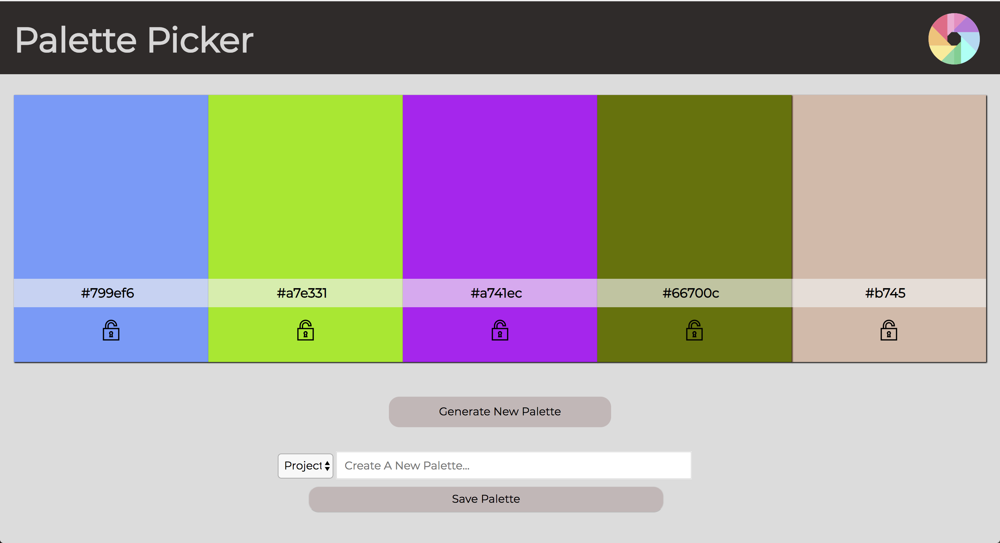
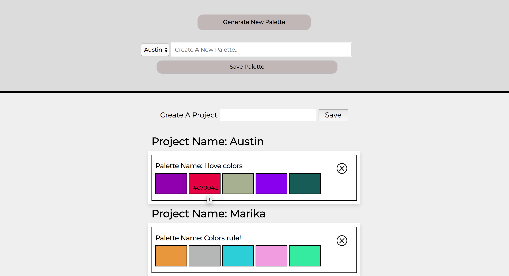

# palette-picker

Palette picker is an application that allows a user to generate random color palettes.  On each palette generation the user can choose to lock a particular color and then when the palette is generated again, that color will be saved and carried over to the next.  Once the user has found a palette that they like, they can create a project and save that palette to the corresponding project folder.

You can download this repo [here](https://github.com/Awiedenman/palette-picker.git). 

## Main Page

## Main Page (scrolled down to view saved projects and palettes)

<!--  -->